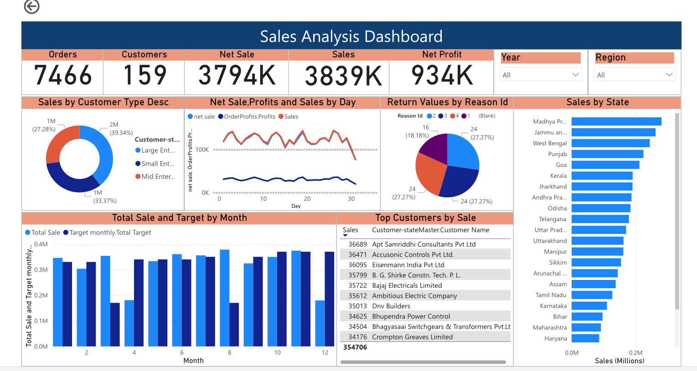
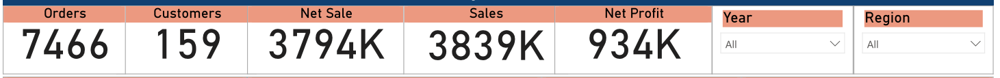
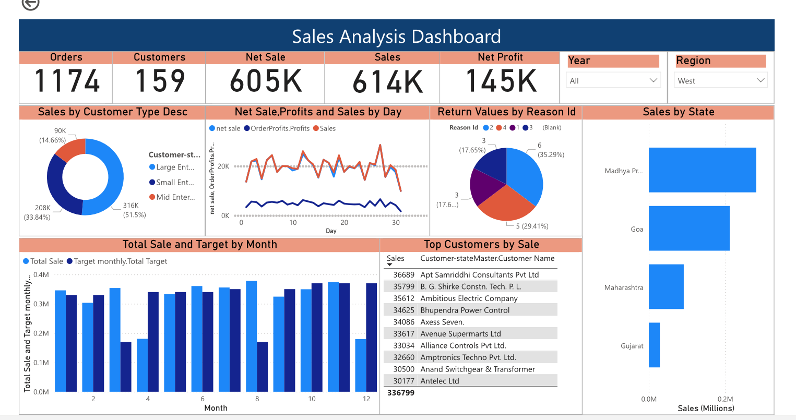

# Sales Analytics Dashboard

## 📊 Overview
This project analyzes retail sales data to uncover trends, customer behavior, and overall business performance using an interactive Power BI dashboard.

## 🧠 Problem Statement
To analyze sales performance and identify key drivers of revenue, customer segmentation, and regional trends to support data-driven business decisions.

## 📁 Dataset
The dataset is a retail sales dataset based on Indian regions, including:
- Sales transactions
- Customer information
- Product categories
- Region, state, and time-based attributes

## ⚙️ Data Transformation
- Connected multiple Excel data sources into Power BI
- Performed data cleaning, formatting, and data type conversions
- Applied transformations based on business requirements using Power Query
- Prepared structured datasets for analysis and reporting

## 🧠 Data Modeling
- Created conditional columns to implement business logic
- Merged and appended datasets to build unified analytical tables
- Designed relationships between tables for efficient querying
- Structured the data model to support KPI calculations and reporting

## ⚙️ Approach
- Performed exploratory data analysis to identify trends and patterns
- Created calculated columns and DAX measures for key metrics
- Built KPIs such as revenue, sales, profit, and customer segmentation
- Designed dashboards to visualize business performance

## 📊 Dashboard Features
- Revenue trends over time (time-series analysis)
- Sales performance by region and state
- Customer segmentation analysis
- KPI cards for Orders, Customers, Sales, Net Sales, and Profit
- Monthly sales vs target comparison
- Top customers and state-wise performance

## 🔄 Dashboard Interactivity
- Enabled dynamic filtering using slicers for region, year, state, and customer type
- Implemented drill-down capabilities for deeper analysis
- Designed user-friendly layout for intuitive data exploration

## 🔍 Key Insights
- Identified top-performing states such as Madhya Pradesh and Goa driving sales
- Highlighted underperforming regions requiring business attention
- Observed patterns in customer purchasing behavior across regions and time
- Detected variations between actual sales and target performance across months

## 🚀 Impact
- Supports data-driven decision-making for business strategy
- Improves visibility into key performance metrics
- Helps identify growth opportunities and operational inefficiencies
- Enables stakeholders to monitor performance interactively

## 📱 Mobile Optimization (Optional)
- Designed a mobile-friendly layout for dashboard accessibility
- Ensured key KPIs and visuals are optimized for smaller screens

## 🛠 Tools Used
- Power BI
- SQL
- Power Query
- DAX

## 🌐 Live Dashboard
[View Dashboard](https://app.powerbi.com/view?r=eyJrIjoiM2FmZDgyZjAtNGIxMi00MGU1LTliNGQtYzc4YTU4M2JjOGU1IiwidCI6IjhjNzhjMTIyLWY3ODEtNDUwMC05YzJhLWY2NDVhNzYyODFmNSJ9)

## 📸 Screenshots

### Dashboard Overview

### KPI Metrics

### Interactive Filters

## 📄 Additional Notes
- This project uses a retail dataset structure similar to standard Superstore datasets
- The dashboard demonstrates end-to-end data analysis including transformation, modeling, visualization, and deployment
